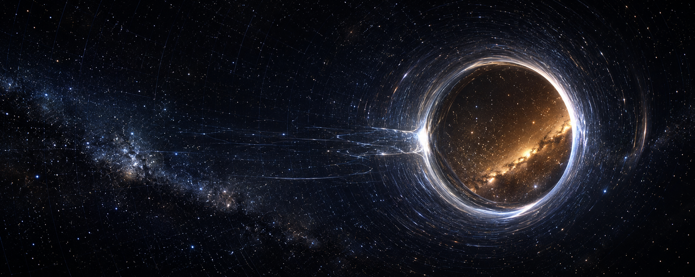

# Wormhole-sim: a relativistic wormhole simulation framework

**Author:** Biswajit Jana  
**Version:** 0.2.0 research preview  
**License:** MIT  
**Live demo:** [https://biswajit1999.github.io/wormhole-simulator/](https://biswajit1999.github.io/wormhole-simulator/)  
**Repository:** [https://github.com/Biswajit1999/wormhole-simulator](https://github.com/Biswajit1999/wormhole-simulator)



## Abstract

`wormhole-sim` is an open-source Python and browser platform for studying
relativistic wormhole spacetimes. The project implements metric definitions,
geodesic integration, curvature and stress-energy diagnostics, energy-condition
tests, embedding surfaces, gravitational-lensing ray tracing, thin-shell
stability, scalar-wave perturbations, quasinormal-mode estimates, and
interactive high-definition web visualizations.

The goal is to give researchers and students a reproducible framework in which
the same metric object can drive analytic diagnostics, numerical integrations,
unit tests, and public-facing simulations. The code uses geometrized units
`G = c = 1`, metric signature `(-,+,+,+)`, and coordinates
`x^mu = (t, r, theta, phi)`.

**Keywords:** general relativity, traversable wormholes, geodesics,
gravitational lensing, exotic matter, numerical relativity, scientific
visualization.

## Live simulation platform

The deployed GitHub Pages site opens directly into the browser simulation
console:

- [Live demo](https://biswajit1999.github.io/wormhole-simulator/)
- [High-definition simulation console](https://biswajit1999.github.io/wormhole-simulator/web/index.html)
- [Real-time geodesic lensing view](https://biswajit1999.github.io/wormhole-simulator/web/realtime.html)
- [3D embedding view](https://biswajit1999.github.io/wormhole-simulator/web/embedding3d.html)

The web console includes lensing, embedding, and curvature-style views with live
controls for throat radius, frame dragging, exposure, metric family, and render
scale. It is static HTML/CSS/JavaScript, so it works on GitHub Pages without a
build step.

## Scientific background

A static, spherically symmetric Morris-Thorne wormhole can be written as [1]

$$
ds^2 =
-e^{2\Phi(r)}dt^2
+ \frac{dr^2}{1-b(r)/r}
+ r^2(d\theta^2+\sin^2\theta\,d\phi^2),
$$

where `Phi(r)` is the redshift function and `b(r)` is the shape function. A
traversable throat at `r = r_0` satisfies

$$
b(r_0)=r_0,\qquad b'(r_0)<1,
$$

and the flare-out condition implies violation of the null energy condition near
the throat:

$$
T_{\mu\nu} k^\mu k^\nu < 0
\quad\text{for some null vector }k^\mu .
$$

For the zero-redshift Morris-Thorne case, the radial NEC combination becomes

$$
\rho+p_r =
\frac{1}{8\pi}\frac{b'(r)r-b(r)}{r^3}.
$$

The Ellis-Bronnikov wormhole is represented by the massless scalar-field metric
[2,3]

$$
ds^2 = -dt^2 + dl^2 + (l^2+b_0^2)
(d\theta^2+\sin^2\theta\,d\phi^2),
$$

where `l` is the proper radial coordinate and `b_0` sets the throat radius. The
project also includes a Teo-style rotating wormhole [4], which introduces frame
dragging through an off-diagonal metric term.

## Implemented model families

| Family | Main parameters | Purpose |
|---|---:|---|
| Morris-Thorne | `b0`, `Phi(r)`, `b(r)` | Canonical traversable wormhole geometry |
| Ellis-Bronnikov | `b0` | Regular two-universe throat and lensing tests |
| Charged wormhole | `b0`, `Q` | Reissner-Nordstrom-inspired throat geometry |
| Teo rotating wormhole | `b0`, `J` | Stationary axisymmetric frame dragging |
| Modified-gravity power law | `b0`, `gamma` | Effective exotic geometry diagnostics |

All metric families expose a common `components(x)` interface. Optional
`components_jax(x)` methods enable autodiff-backed Christoffel symbols when JAX
is installed.

## Mathematical and numerical formulation

### Connection and curvature

For a metric `g_{mu nu}`, the Christoffel symbols are computed from

$$
\Gamma^\lambda_{\mu\nu}
= \frac{1}{2}g^{\lambda\sigma}
\left(
\partial_\mu g_{\sigma\nu}
+\partial_\nu g_{\sigma\mu}
-\partial_\sigma g_{\mu\nu}
\right).
$$

The default backend uses fourth-order Richardson finite differences. When JAX
is available and the metric provides a JAX-compatible component function, the
same API can use automatic differentiation.

The Riemann tensor follows

$$
R^\rho_{\ \sigma\mu\nu}
=
\partial_\mu \Gamma^\rho_{\nu\sigma}
-\partial_\nu \Gamma^\rho_{\mu\sigma}
+\Gamma^\rho_{\mu\lambda}\Gamma^\lambda_{\nu\sigma}
-\Gamma^\rho_{\nu\lambda}\Gamma^\lambda_{\mu\sigma},
$$

with Ricci tensor, Ricci scalar, Einstein tensor, and stress-energy tensor
computed as

$$
R_{\mu\nu}=R^\alpha_{\ \mu\alpha\nu},
\qquad
G_{\mu\nu}=R_{\mu\nu}-\frac{1}{2}g_{\mu\nu}R,
\qquad
T_{\mu\nu}=\frac{G_{\mu\nu}}{8\pi}.
$$

### Geodesics

Null and timelike trajectories are integrated using

$$
\frac{d^2 x^\mu}{d\lambda^2}
+\Gamma^\mu_{\alpha\beta}
\frac{dx^\alpha}{d\lambda}
\frac{dx^\beta}{d\lambda}=0.
$$

The package rewrites this as a first-order ODE system and integrates it with
adaptive `RK45` or a fixed-step `RK4` fallback. The invariant

$$
\epsilon = g_{\mu\nu}u^\mu u^\nu
$$

is monitored along the trajectory; `epsilon = 0` for null rays and
`epsilon = -1` for unit-normalized timelike particles.

### Energy conditions and exotic matter

The diagnostics include NEC, WEC, SEC, DEC, the averaged null energy condition,
and a volume-integral quantifier for exotic matter. For a sampled null geodesic,
the ANEC integral is approximated by

$$
I_\text{ANEC}
= \int T_{\mu\nu}k^\mu k^\nu\,d\lambda .
$$

Negative values indicate averaged null-energy violation, a central feature of
traversable wormhole physics [1,5].

### Lensing and perturbations

For Ellis-type lensing, the framework evaluates deflection curves and ray-traced
images by combining geodesic integration with image-plane sampling. For scalar
perturbations of the Ellis throat, the effective Regge-Wheeler-type potential is

$$
V_l(x)
= \frac{l(l+1)}{x^2+b_0^2}
- \frac{b_0^2}{(x^2+b_0^2)^2},
$$

and time-domain ringdown signals are fitted to estimate a damped fundamental
mode

$$
\psi(t) \sim A e^{-i\omega t},
\qquad
\operatorname{Im}(\omega)<0 .
$$

## Project capabilities

| Area | Methods and outputs |
|---|---|
| Differentiation | JAX autodiff or fourth-order Richardson finite differences |
| Geometry | Christoffels, Riemann tensor, Ricci tensor, Einstein tensor |
| Geodesics | RK45/RK4 integration, null initial velocity construction, norm drift |
| Conservation | Energy and angular momentum monitoring for symmetric metrics |
| Energy conditions | NEC, WEC, SEC, DEC, ANEC, exotic-matter integral |
| Thin shells | Israel-junction-inspired potential and stability scan |
| Rotation | Teo frame dragging, ZAMO angular velocity, ergoregion test |
| Lensing | Deflection curves and backward-ray-traced visualizations |
| Perturbations | Scalar wave evolution and quasinormal-mode extraction |
| Semiclassical bounds | Casimir density and Ford-Roman quantum inequality checks |
| Visualization | Static figures, browser canvas, WebGL, Streamlit, Blender hooks |

## Installation and quick start

```bash
git clone https://github.com/Biswajit1999/wormhole-simulator.git
cd wormhole-simulator

# Option A: Conda
conda env create -f environment.yml
conda activate wormhole-sim

# Option B: editable pip install
python -m pip install -e ".[dev]"

# Verify the project
pytest -q
python examples/run_demos.py
python examples/run_advanced.py
```

Minimal null-geodesic example:

```python
import numpy as np

from core.metrics import EllisBronnikov
from core import symmetries as sym
from numerics.geodesic import GeodesicSolver, null_initial_velocity

wh = EllisBronnikov(b0=1.0)
x0 = np.array([0.0, 6.0, np.pi / 2, 0.0])
u0 = null_initial_velocity(wh, x0, [-1.0, 0.0, 0.05])

res = GeodesicSolver(wh).integrate(x0, u0, affine_span=(0, 20))

print("throat crossed:", res.coords[:, 1].min() < 0)
print("conservation drift:", sym.monitor_conservation(wh, res))
```

## Repository layout

```text
wormhole-simulator/
|-- core/
|   |-- metrics.py             # Morris-Thorne, Ellis, charged, Teo
|   |-- backend.py             # autodiff / Richardson Christoffels
|   |-- stress_energy.py       # curvature, Einstein tensor, energy conditions
|   |-- thinshell.py           # thin-shell stability
|   |-- semiclassical.py       # Casimir and Ford-Roman checks
|   `-- modified_gravity.py    # modified-gravity wormholes
|-- numerics/
|   |-- geodesic.py            # RK45/RK4 geodesic integrator
|   |-- orbits.py              # equatorial orbit utilities
|   |-- pde_solver.py          # finite-difference scalar wave solver
|   |-- spectral.py            # Chebyshev pseudospectral methods
|   |-- qnm.py                 # quasinormal-mode extraction
|   `-- et_bridge.py           # Einstein Toolkit .par helper
|-- visualization/
|   |-- embed.py
|   |-- penrose.py
|   |-- raytrace.py
|   |-- lensing_image.py
|   `-- blender_render.py
|-- web/
|   |-- index.html             # high-definition simulation console
|   |-- realtime.html          # browser geodesic lensing renderer
|   |-- embedding3d.html       # 3D embedding surface
|   `-- app.py                 # Streamlit dashboard
|-- examples/
|-- tests/
|-- docs/
|-- index.html                 # GitHub Pages redirect to web/index.html
|-- pyproject.toml
|-- environment.yml
`-- Dockerfile
```

## Validation status

The project is covered by 32 unit tests and a GitHub Actions matrix for Python
3.10, 3.11, and 3.12. The tests cover metric signatures, inverse consistency,
Christoffel tensor shape, geodesic norm conservation, throat crossing, energy
condition violation, thin-shell equilibrium, rotating frame dragging,
quasinormal-mode extraction, semiclassical inequalities, and modified-gravity
geometry.

Current CI status should be visible under the repository Actions tab:

[GitHub Actions](https://github.com/Biswajit1999/wormhole-simulator/actions)

## Scope and limitations

This project is a research and education framework. It is not a full numerical
relativity evolution code, and the browser renderers are interactive scientific
visualizations rather than precision solvers. High-precision results should be
validated against analytic limits, convergence studies, and domain-specific
numerical relativity tools.

## How to cite

If you use this code, cite the repository and the primary physics literature.
The repository also includes [`CITATION.cff`](CITATION.cff).

```bibtex
@software{jana_wormhole_sim_2026,
  author       = {Biswajit Jana},
  title        = {wormhole-sim: a relativistic wormhole simulation framework},
  year         = {2026},
  version      = {0.2.0},
  url          = {https://github.com/Biswajit1999/wormhole-simulator},
  license      = {MIT}
}
```

## References

[1] M. S. Morris and K. S. Thorne, "Wormholes in spacetime and their use for
interstellar travel: A tool for teaching general relativity," *American Journal
of Physics* 56, 395-412 (1988). DOI:
[10.1119/1.15620](https://doi.org/10.1119/1.15620).

[2] H. G. Ellis, "Ether flow through a drainhole: A particle model in general
relativity," *Journal of Mathematical Physics* 14, 104-118 (1973). DOI:
[10.1063/1.1666161](https://doi.org/10.1063/1.1666161).

[3] K. A. Bronnikov, "Scalar-tensor theory and scalar charge," *Acta Physica
Polonica B* 4, 251-266 (1973).

[4] E. Teo, "Rotating traversable wormholes," *Physical Review D* 58, 024014
(1998). DOI:
[10.1103/PhysRevD.58.024014](https://doi.org/10.1103/PhysRevD.58.024014).

[5] L. H. Ford and T. A. Roman, "Averaged energy conditions and quantum
inequalities," *Physical Review D* 51, 4277-4286 (1995). DOI:
[10.1103/PhysRevD.51.4277](https://doi.org/10.1103/PhysRevD.51.4277).

[6] M. Visser, *Lorentzian Wormholes: From Einstein to Hawking*, AIP Press
(1995).

[7] A. Einstein and N. Rosen, "The particle problem in the general theory of
relativity," *Physical Review* 48, 73-77 (1935). DOI:
[10.1103/PhysRev.48.73](https://doi.org/10.1103/PhysRev.48.73).

[8] T. Regge and J. A. Wheeler, "Stability of a Schwarzschild singularity,"
*Physical Review* 108, 1063-1069 (1957). DOI:
[10.1103/PhysRev.108.1063](https://doi.org/10.1103/PhysRev.108.1063).

## License

MIT license. See [`LICENSE`](LICENSE).
