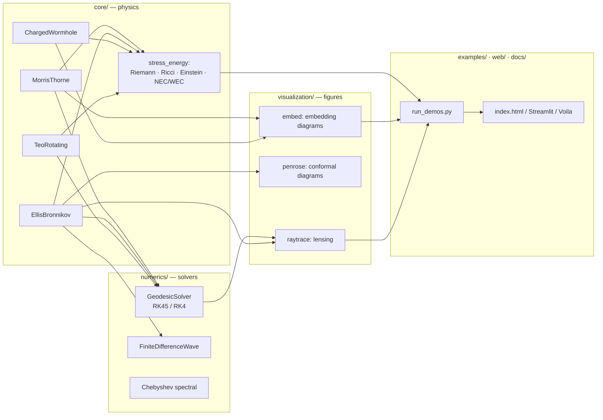
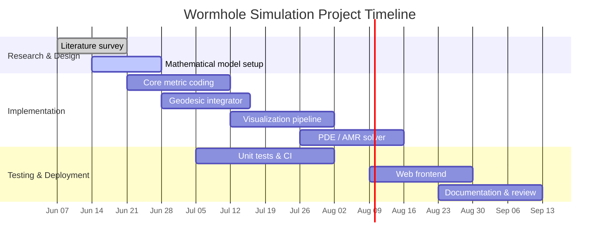

# Software Architecture

## Module design

The package separates **physics** (`core`), **solvers** (`numerics`), and
**rendering** (`visualization`). The dependency rule is one-directional:
`visualization` and `numerics` depend on `core`, never the reverse.



## API at a glance

```python
# 1. Geometry — every metric exposes the same interface
from core.metrics import MorrisThorne
wh = MorrisThorne(b0=1.0)              # or EllisBronnikov, ChargedWormhole, TeoRotating
g     = wh.components(x)               # 4x4 covariant metric at x = (t, r, theta, phi)
ginv  = wh.inverse(x)
Gamma = wh.christoffel(x)             # (4,4,4) connection (override for analytic)

# 2. Curvature & energy conditions
from core import stress_energy as se
G     = se.einstein_tensor(wh, x)
nec   = se.null_energy_condition(wh, x)   # < 0  => exotic matter / NEC violation
K     = se.kretschmann(wh, x)

# 3. Geodesics
from numerics.geodesic import GeodesicSolver, null_initial_velocity
u0  = null_initial_velocity(wh, x, [-1, 0, 0.05])
res = GeodesicSolver(wh).integrate(x, u0, affine_span=(0, 50))

# 4. Visualization
from visualization.embed import plot_embedding_surface
from visualization.raytrace import EquatorialRayTracer
plot_embedding_surface(wh, r0=1.0)
outcomes = EquatorialRayTracer(wh).fan([-0.3, 0.0, 0.3])
```

**Extension point:** to add a metric, subclass `Metric` and implement
`components(x)`. Curvature, energy conditions, geodesics and embeddings then work
unchanged — see `CONTRIBUTING.md`.

## Environment setup

**Conda**
```bash
conda env create -f environment.yml
conda activate wormhole-sim
```

**pip / editable**
```bash
python -m venv .venv && source .venv/bin/activate
pip install -e ".[dev]"
```

**Docker**
```bash
docker build -t wormhole-sim .
docker run --rm wormhole-sim pytest -q
```

## Continuous integration

`.github/workflows/ci.yml` runs lint (`ruff`), the test suite across Python
3.10–3.12, and a headless smoke-test of `examples/run_demos.py`, then uploads
`web/` as a Pages artifact. CI skeleton:

```yaml
name: CI
on: [push, pull_request]
jobs:
  test:
    runs-on: ubuntu-latest
    strategy:
      matrix: { python-version: ["3.10", "3.11", "3.12"] }
    steps:
      - uses: actions/checkout@v4
      - uses: actions/setup-python@v5
        with: { python-version: "${{ matrix.python-version }}" }
      - run: pip install -e ".[dev]"
      - run: ruff check .
      - run: pytest -q --cov=core --cov=numerics --cov=visualization
      - run: MPLBACKEND=Agg python examples/run_demos.py
```

## Data formats

HDF5/NetCDF for grids and trajectory bundles, JSON/CSV for run parameters, PNG/JPEG
for figures. Large lensing renders are not committed; `examples/run_demos.py`
regenerates all figures deterministically.

## Project timeline


