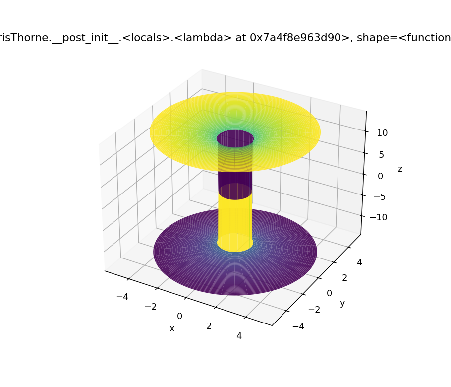
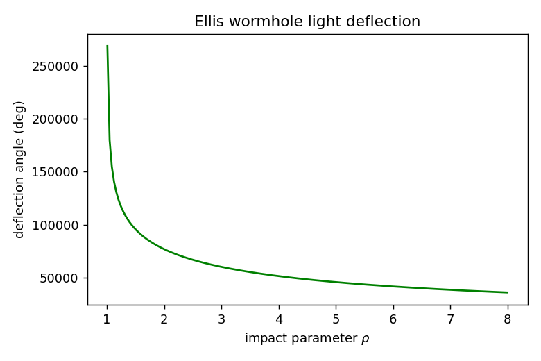

# Visualization

Three complementary views: the **embedding diagram** (intrinsic geometry), the
**Penrose diagram** (causal structure), and **ray-traced lensing** (observable
signature). Each consumes the same `core.metrics` objects.

---

## 1. Embedding diagrams

A constant-$t$, equatorial slice of a Morris–Thorne wormhole has the 2-metric
$d\ell^2 = dr^2/(1-b/r) + r^2 d\phi^2$, embedded in flat $(r,\phi,z)$ space with

$$
\frac{dz}{dr} = \pm\left[\frac{r}{b(r)} - 1\right]^{-1/2}.
$$

Integrating and revolving gives the classic two-sheeted "tunnel" flaring out of the
throat. `visualization.embed.plot_embedding_surface(metric, r0)` produces it for
Morris–Thorne, charged, and Ellis metrics (Ellis gives the catenoid).

```python
import matplotlib.pyplot as plt
from core.metrics import MorrisThorne
from visualization.embed import plot_embedding_surface

plot_embedding_surface(MorrisThorne(b0=1.0), r0=1.0, r_max=5.0)
plt.show()
```



---

## 2. Penrose (conformal) diagrams

A traversable wormhole joins two asymptotically flat universes through a
**horizonless** timelike throat — so its conformal diagram is two Minkowski diamonds
sharing the throat line, unlike the Schwarzschild bridge whose throat is a horizon.
`visualization.penrose.penrose_wormhole()` draws the schematic with $\mathcal{I}^\pm$,
$i^0$, $i^\pm$ labelled for each universe. For publication-grade conformal diagrams,
export the same schematic to TikZ/PGF.

---

## 3. Gravitational lensing by ray-tracing

The observable signature of a wormhole is how it **lenses** a background star field:
multiple images, Einstein rings, and — uniquely — light arriving from *the other
universe* through the throat.

**Physics core (provided):**

- `deflection_angle(b0, rho)` — exact Ellis bending angle by quadrature.
- `EquatorialRayTracer` — shoots a fan of null geodesics backward from an observer
  and records, per ray, whether it crossed the throat and its asymptotic direction.

**Full image pipeline (recipe):**

```text
for each pixel (i, j) on the observer's screen:
    alpha = screen_angle(i, j)                  # map pixel -> initial direction
    u0 = null_initial_velocity(metric, x_obs, dir(alpha))
    ray = GeodesicSolver(metric).integrate(x_obs, u0)
    if ray crossed throat:  sample texture_B(final_direction)   # other universe
    else:                   sample texture_A(final_direction)   # same universe
    image[i, j] = sampled_color
```

This is the same backward-ray-tracing strategy used for the *Interstellar* wormhole
(James et al. 2015) and the classic Tübingen renderings [WIKI†L121-L129]. Swap the
SciPy integrator for a JAX-batched kernel or a GLSL fragment shader for real-time
rates; the geometry (metric + Christoffels) is unchanged.



---

## 4. Tool comparison

| Tool | Capability | Strength |
|---|---|---|
| **Matplotlib** | 2D plots, basic 3D surfaces | Default here; zero-config, publication-ready |
| **Mayavi** | High-quality 3D scientific surfaces | Best for embedding/curvature surfaces |
| **Plotly / three.js** | Interactive 3D in the browser | Shareable web demos, rotate/zoom |
| **Blender** | Photorealistic ray-traced renders | Cinematic stills/animation (OBJ import + Python API) |
| **ParaView / VisIt** | Large volumetric/AMR data | Evolution data from Einstein Toolkit |
| **TikZ / PGF** | Vector schematic diagrams | Penrose/embedding figures for papers |

## 5. Interactive front-ends

- **Jupyter + ipywidgets:** sliders for $b_0$, $Q$, $J$, impact parameter; live
  re-render of embedding/lensing. Convert to a site via **Voilà** or **Binder**.
- **Streamlit:** a parameter panel that calls the same API and shows the lensed image.

## References
- **[WIKI†L121-L129]** O. James, E. von Tunzelmann, P. Franklin & K. Thorne,
  *Visualizing Interstellar's wormhole*, Am. J. Phys. **83**, 486 (2015); Wikimedia
  Commons wormhole ray-tracing renders (Montenegro & Zahn 2008).
